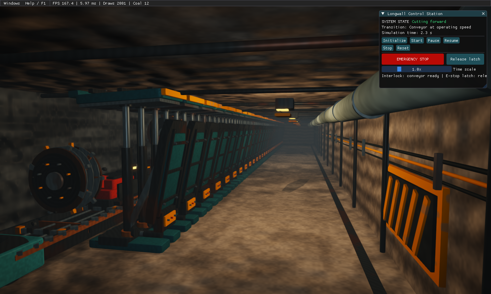

# 2026 课程图形学项目：煤矿井下综采工作面仿真


`MineLongwallSimulation` 是一个使用 C++17 与 OpenGL 3.3 Core 编写的计算机图形学课程项目。程序通过程序化网格构建长壁工作面、30 台液压支架、双滚筒采煤机、刮板输送机、通风管、井下灯具和煤岩空间，并以确定性状态机驱动割煤、运煤、跟机移架、故障与急停。

> 本项目仅用于计算机图形学与软件工程教学可视化，不可用于真实煤矿控制、安全认证或生产决策。



*OpenGL 实际运行截图：煤壁、双滚筒采煤机、交错链环、倾斜液压立柱和喷雾。所有几何与表面仍由程序生成。*

[液压支架近景](docs/images/supports.png) · [顶视剖切](docs/images/cutaway.png) · [参考来源](docs/REALISM_REFERENCES.md)

## 项目亮点

- **纯 OpenGL 图形链路**：GGX PBR、工作灯 PCF 阴影、HDR、4× MSAA、Bloom、SSAO、ACES、FXAA 与调试视图均在 OpenGL / GLSL 中实现；
- **无外部模型和图片纹理**：工业设备、煤岩表面、磨损与材质细节均由代码和着色器程序化生成；
- **完整动态场景**：采煤机往返割煤、滚筒旋转、输送机运煤、30 台支架顺序跟机，动作使用连续插值而非瞬移；
- **可交互教学演示**：支持设备拾取、六个固定视角、自由相机、故障注入、急停联锁、实时属性与事件日志；
- **可复现验证**：逻辑测试覆盖核心状态转换，自动捕获模式可生成六个固定视角的验收截图。

## 快速开始

### 下载已编译程序

- [Windows x64 运行包](https://github.com/mohui666/2026-Computer-Graphics-Course-Project/releases/latest/download/MineLongwallSimulation-Windows-x64.zip)：完整解压后双击 `MineLongwallSimulation.exe`，保留同目录的 `assets` 文件夹，无需安装编译工具。
- [完整课程提交包](https://github.com/mohui666/2026-Computer-Graphics-Course-Project/releases/latest/download/MineLongwallSimulation-Submission.zip)：包含开发文档（Word/PDF）、完整源码、Windows 程序和 Mac 应用。
- [发布页面与验证说明](https://github.com/mohui666/2026-Computer-Graphics-Course-Project/releases/latest)。GitHub 的 **Code → Download ZIP** 仅下载源码；直接运行请使用上面的运行包。

Windows 程序适用于 Windows 10/11 x64，需要支持 OpenGL 3.3 的显卡驱动。当前 exe 已在 Mac 上交叉编译，尚未完成 Windows 实机验证。Apple Silicon Mac 版本已实际运行，具体记录见 [开发文档](docs/DEVELOPMENT.md)。

### macOS

安装 Xcode Command Line Tools、CMake 3.24+ 和 Python 3，然后执行：

```sh
./build.sh
./run.command
```

也可直接双击 `build-macos/bin/Release/MineLongwallSimulation.app`。提交文件夹中的 `.app` 已编译，无需安装开发依赖；本次交付为 Apple Silicon（arm64）版本。Intel Mac 请在对应机器上从源码构建。支持的最低构建目标为 macOS 11，实际运行验证见 [开发文档](docs/DEVELOPMENT.md)。

Mac 默认限制最高 30 FPS；后台降到 5 FPS，最小化停止绘制。默认 2× MSAA，实时阴影和 SSAO 关闭，可在高级设置中按需开启。OpenGL 渲染仍由 Apple GPU 执行。

`build.sh` 在 `.venv-build` 内安装 Jinja2，从固定版本的 GLAD 源码生成加载器。使用已安装 Homebrew 的机器可执行 `brew install cmake` 安装 CMake。

### Windows

安装 Visual Studio 2022（含“使用 C++ 的桌面开发”）、CMake 3.24+ 和 Python 3 后，在 PowerShell 中执行：

```powershell
git clone https://github.com/mohui666/2026-Computer-Graphics-Course-Project.git
cd 2026-Computer-Graphics-Course-Project
.\build.bat
.\run.bat
```

首次配置会下载固定版本的图形依赖。构建完成后，也可以直接运行 `build/bin/Release/MineLongwallSimulation.exe`。

## 已实现功能

- OpenGL 3.3 Core、GLAD、GLFW、GLM、Dear ImGui、GLSL 顶点/片元着色器；
- 可复用 Cube/Cylinder/Rock、倒角箱体、梯形支架盾板、双头螺旋滚筒叶片与确定性粗糙曲面 Mesh，位置、法线、UV、VAO/VBO/EBO 及 RAII 资源释放；
- Model/View/Projection、法线矩阵、深度测试、背面剔除、透明混合和窗口自适应；
- Cook–Torrance / GGX / Smith / Schlick 材质，六盏支架下工作灯、相机头灯、煤岩细节法线、湿润粗糙度、掉漆和煤尘覆盖；
- 相机附近两盏工作灯使用 2048×2048 深度纹理数组和 3×3 PCF 阴影，远灯提供补光；
- RGBA16F HDR、4× MSAA resolve、半分辨率 Bloom、SSAO 接触阴影、ACES 色调映射、抖动、暗角和 FXAA；
- 30 台编号液压支架，独立压力和 `等待 → 降架 → 移架 → 升架 → 正常` 动作；
- 双滚筒采煤机的父子式部件组合、平滑启停、往返换向、旋转滚筒和确定性遥测；
- 刮板输送机启停/调速、运动刮板、负载、煤块运输及堵塞联锁；
- 煤块从实际滚筒附近落到槽板表面，并与刮板同向朝机头运输；
- 实际滚筒位置驱动的水雾与煤尘，透明广告牌按深度排序，暂停冻结、停止后消散、复位清空；
- 倾斜立柱、弯曲软管、阀组、交错运动链环、机头驱动电机，支架后方以采空区碎岩封闭；
- 11 状态集中式状态机，含暂停/继续/停止/复位/故障恢复/锁存急停；
- 采煤机过热、输送机堵塞、支架低压、照明故障、急停；
- WASD/QE/Shift 自由相机、右键观察、六个固定视角、设备聚焦；
- 鼠标射线与 AABB 拾取、单设备高亮、可选包围盒；
- 中文单面板、一键开始/暂停/继续、跟随机位、设备详情、折叠式高级设置和三步帮助；
- 线框、坐标轴、包围盒、VSync、雾和灯光开关；
- F12 帧缓冲 BMP 截图；
- 逻辑自动测试覆盖 Transform、状态机、换向、暂停、复位、急停、支架动作、故障和配置边界。

## 环境与依赖

- Windows 10/11 x64，或 macOS 11+；
- Windows：Visual Studio 2022（“使用 C++ 的桌面开发”）；macOS：Xcode Command Line Tools；
- CMake 3.24 或更高；
- Python 3（仅供固定版本 GLAD 2.0.8 生成源码）；
- 首次配置时可访问 GitHub。

CMake `FetchContent` 固定获取：GLM 1.0.1、GLFW 3.4、GLAD 2.0.8、Dear ImGui 1.91.8。GLAD 生成器直接从固定版本源码目录运行；Python 只需安装 `requirements-build.txt` 中的 Jinja2，不会修改系统 Python。

## 构建

最简单方式：

```bat
build.bat
```

等价的手工命令：

```powershell
python -m venv .venv-build
.\.venv-build\Scripts\python.exe -m pip install -r requirements-build.txt
cmake -S . -B build -G "Visual Studio 17 2022" -A x64 -DMINE_BUILD_APP=ON -DMINE_BUILD_TESTS=ON -DPython_EXECUTABLE="$PWD/.venv-build/Scripts/python.exe"
cmake --build build --config Debug --parallel
ctest --test-dir build -C Debug --output-on-failure
cmake --build build --config Release --parallel
ctest --test-dir build -C Release --output-on-failure
```

若只验证仿真逻辑、不构建图形程序：

```powershell
cmake -S . -B build-core -G "Visual Studio 17 2022" -A x64 -DMINE_BUILD_APP=OFF
cmake --build build-core --config Debug --parallel
ctest --test-dir build-core -C Debug --output-on-failure
```

### 离线依赖

联网机器首次配置后，保留 `build/_deps` 可继续构建。完全离线的新机器可把四个依赖仓库放到 `external/{glm,glfw,glad,imgui}`，然后配置时追加：

```powershell
-DFETCHCONTENT_SOURCE_DIR_GLM=external/glm `
-DFETCHCONTENT_SOURCE_DIR_GLFW=external/glfw `
-DFETCHCONTENT_SOURCE_DIR_GLAD=external/glad `
-DFETCHCONTENT_SOURCE_DIR_IMGUI=external/imgui
```

这些目录必须对应上文固定版本。Python 虚拟环境需预装 Jinja2；GLAD 直接从本地源码运行。

## 运行

```bat
run.bat
```

或：

```powershell
.\build\bin\Release\MineLongwallSimulation.exe
```

程序从可执行文件位置定位着色器：Windows 的 `assets` 文件夹与 exe 同级，macOS 的资源位于 `.app/Contents/Resources/assets`。可移动整个程序文件夹，不依赖源码目录或当前工作目录。自动图形冒烟与截图模式：

```powershell
.\build\bin\Release\MineLongwallSimulation.exe --capture
```

它会在隐藏的真实 OpenGL 窗口中，以固定 1/60 秒步长初始化和开始仿真，在仿真时间 4 秒保存无 UI 的 `screenshots/latest.bmp` 并退出。截图失败或 OpenGL 报错会返回失败。加 `--capture-ui` 可以保留中文操作面板；`--capture-ui --capture-time=0.05` 可截取开始前的界面。
可用 `--capture-time=16` 检查换向后的状态，用 `--capture-output=screenshots/shearer.bmp` 指定输出。
可追加 `--capture-view=overview|shearer|supports|conveyor|entrance|top`，对指定固定视角执行可复现的画面验收。

## 操作

| 操作 | 输入 |
|---|---|
| 前后左右移动 | `W/S/A/D` |
| 上升/下降 | `E/Q` |
| 加速移动 | `Shift` |
| 观察 | 按住鼠标右键拖动 |
| 选择设备 | 鼠标左键 |
| 全景/采煤机/支架/输送机/入口/顶视 | `1`～`6` |
| 重置相机 / 聚焦所选设备 | `R` / `F` |
| 截图 | `F12` |
| 显示 / 隐藏控制面板 | `Tab` |
| 一键开始 / 暂停 / 继续 | `Space` |
| 帮助 / 退出 | `F1` / `Esc` |

默认只显示一个中文面板，常用操作不需要打开高级设置。画面、故障演示、调试参数和原始日志收在「高级设置（可以先不管）」中。顶视图自动剖开顶板与后方碎岩，并开启检查补光，便于观察设备排布；其余视角默认显示完整井下空间。

打开程序后，点击 **开始演示** 即可，初始化与启动输送机会自动依次完成，原有联锁仍然生效。

- 想看不同设备：点「看采煤机」「看液压支架」「看运煤」或「全景俯视」。
- 想看清细节：点「暂停演示」，再点同一位置的「继续演示」。
- 想从头再看：点「重新开始」。默认镜头跟随采煤机；自己移动相机会取消跟随，点「看采煤机」可恢复。
- 不明白时：点「怎么使用」查看三步说明。故障与急停演示位于高级设置，急停锁定后必须先明确点击「解除急停」。

中文界面使用系统字体：Windows 为微软雅黑，macOS 为冬青黑体（Hiragino Sans GB）。字体图集按 framebuffer 比例生成，字体文件不随项目复制。Mac 默认采用 1280×768 窗口和普通像素分辨率，避免 Retina 使渲染像素数增加到四倍。[查看简化界面](docs/images/simple-ui.png)。

## 目录

```text
assets/shaders/              GLSL 着色器
src/core/                    窗口、主循环、输入、配置
src/graphics/                相机、Shader、Mesh、Renderer
src/scene/                   Transform
src/equipment/               采煤机、支架、输送机
src/simulation/              状态机、联动、事件日志
src/particles/               煤尘粒子
src/ui/                      Dear ImGui 控制台
tests/                       无图形上下文逻辑测试
docs/                        架构、代码、重构、报告和演示稿
```

## 故障排查

- Python 缺少 Jinja2：运行 `build.sh` 或 `build.bat`，或在虚拟环境安装 `requirements-build.txt` 并向 CMake 指定 `Python_EXECUTABLE`。
- 无法创建 OpenGL 窗口：更新显卡驱动，确认远程桌面会话提供 OpenGL 3.3 Core。
- 着色器找不到：Windows 需保留 exe 同级的 `assets`；macOS 需保留完整 `.app`。
- Mac 双击 `.app` 可直接运行；F12（部分键盘为 Fn+F12）的截图保存到 `~/Pictures/MineLongwallSimulation/latest.bmp`。Windows 保存到 exe 同级 `screenshots/latest.bmp`。
- `.exe` 是 Windows 程序；Mac 请运行 `.app`。
- 画面过暗：打开 `Headlamp` 和 `Work lights`，降低雾密度；照明故障会真实关闭工作灯。
- 急停后不能复位：先点击「解除急停」，再点击「开始演示」或「重新开始」，这是设计的安全联锁。

## 范围与限制

本版参考真实设备照片及开源 OpenGL 渲染实现，具体来源和实现对应见 [现实与开源参考](docs/REALISM_REFERENCES.md)。已加入局部工作灯 Shadow Mapping，保留程序化建模和材质。未实现 GPU Instancing、图片纹理、外部模型、配置持久化、煤壁体积切削和真实岩层力学。采煤速度与支架循环仍为便于课堂观察的演示参数，不代表某一型号的工程精度；本次也没有引入 IBL 或全场景全光源阴影。

## 项目文档

- [跨平台开发与提交文档](docs/DEVELOPMENT.md)

- [课程报告](docs/COURSE_REPORT.md)
- [系统架构](docs/ARCHITECTURE.md)
- [代码讲解](docs/CODE_EXPLANATION.md)
- [测试报告](docs/TEST_REPORT.md)
- [演示脚本](docs/DEMO_SCRIPT.md)
- [重构记录](docs/REFACTORING.md)

## 在 macOS 生成 Windows 提交程序

先运行一次 `build.sh` 准备 Python 环境。安装 `mingw-w64` 后：

```sh
cmake -S . -B build-windows -DCMAKE_BUILD_TYPE=Release \
  -DCMAKE_TOOLCHAIN_FILE=cmake/mingw-w64.cmake \
  -DPython_EXECUTABLE="$PWD/.venv-build/bin/python"
cmake --build build-windows --parallel
cmake --install build-windows --config Release --component Runtime --prefix dist/windows
```

MinGW 构建静态链接 C/C++ 运行库；Windows 自带的系统 DLL 仍由系统提供。macOS 可用 `cmake --install build-macos --config Release --component Runtime --prefix dist/macos` 导出完整 `.app`。交叉编译成功与 Windows 实机运行属于不同验证步骤，本次结果见开发文档。
