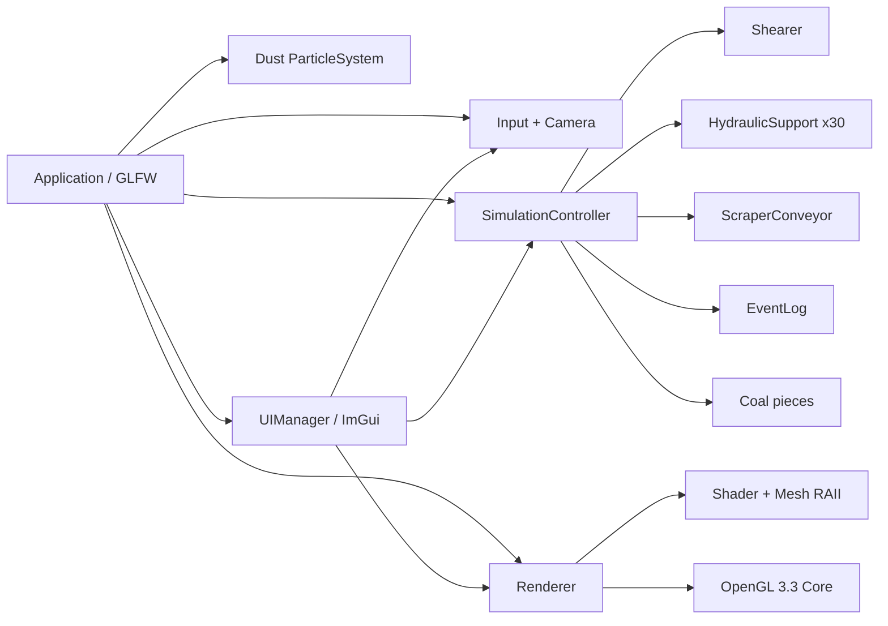
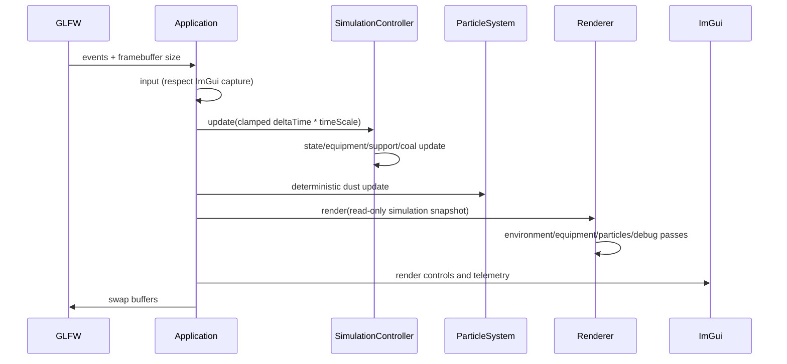
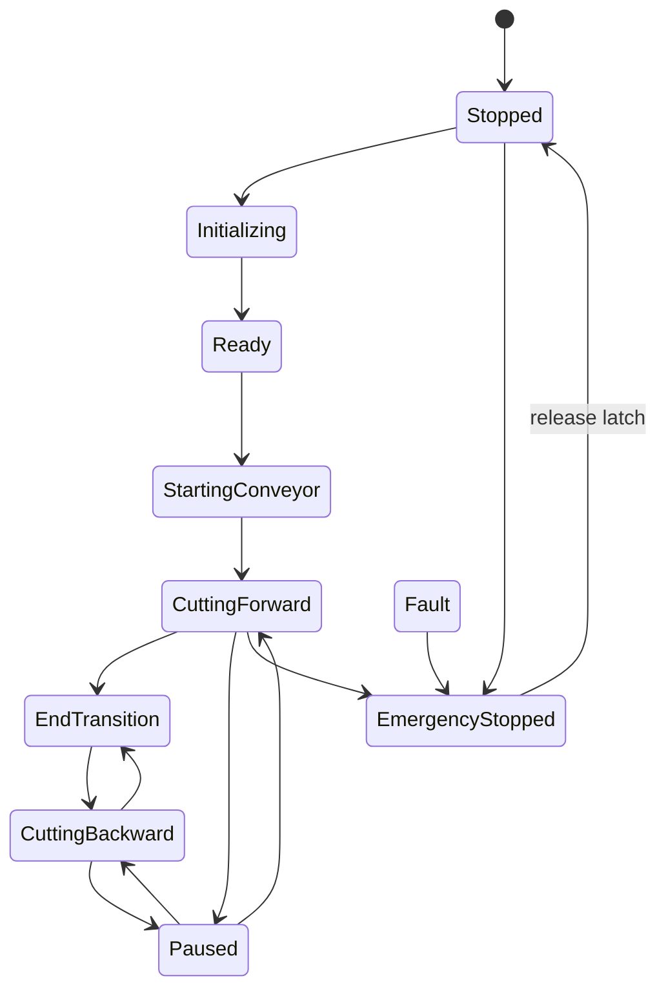

# 架构说明

## 目标

系统把“业务仿真”和“OpenGL 表现”分开：设备类只更新确定性状态，渲染器只读取快照并提交绘制。测试程序因此无需创建图形上下文即可覆盖主要安全与联动规则。

## 模块职责

| 模块 | 职责 | 不负责 |
|---|---|---|
| `Application` | GLFW/GLAD/ImGui 生命周期、主循环、输入分发、退出顺序 | 设备业务规则 |
| `Camera` | View/Projection、六种视角、自由移动、屏幕射线 | 绘制设备 |
| `Shader` / `Mesh` | GLSL、Uniform、VAO/VBO/EBO 和 OpenGL 句柄 RAII | 仿真状态 |
| `Renderer` | 场景组合、材质、光照/雾、调试绘制、拾取 AABB、截图 | 改变设备状态 |
| `PostProcessor` | 4× HDR MSAA、resolve、Bloom、SSAO、ACES、FXAA 与 FBO resize/RAII | 设备业务与 UI 绘制 |
| `SimulationController` | 集中状态机、联锁、时间缩放、故障、煤块和跟机触发 | OpenGL 调用 |
| 设备类 | 各设备内部参数与 `deltaTime` 更新 | UI 和窗口 |
| `ParticleSystem` | 有上限、有寿命的煤尘 CPU 粒子 | 煤块业务库存 |
| `UIManager` | 操作面板、遥测、故障、日志、设置、帮助 | 绕过状态机联锁 |

## 每帧数据流

`deltaTime` 被限制在 0～0.1 秒，避免窗口拖动或断点后产生巨大一步。暂停和锁存急停不推进仿真时钟；急停同时把采煤机和输送机速度立即归零。

## 状态机

`Warning` 用于支架低压和照明异常，`Fault` 用于采煤机过热或输送机堵塞。每次转换保存前状态、进入时刻和原因；非法转换被拒绝并写日志。急停可以从任何非急停状态进入，但锁存期间复位和初始化都被阻止。

## 资源与退出顺序

`Shader`、`Mesh` 禁止复制，提供移动语义；析构释放 Program、VAO、VBO、EBO。退出顺序固定为：停止循环 → ImGui OpenGL 后端 → Renderer/OpenGL 资源 → GLFW Window → `glfwTerminate`。这保证删除 OpenGL 句柄时上下文仍有效。

## 坐标与场景

- X：工作面长度方向；
- Y：竖直方向；
- Z：煤壁到巷道入口方向；
- 地板约 Y=0，煤壁位于负 Z 侧；
- 支架沿 X 均布，输送机与工作面平行；
- 顶视相机采用教学剖视：相机高于顶板时 Renderer 不绘制顶板。
