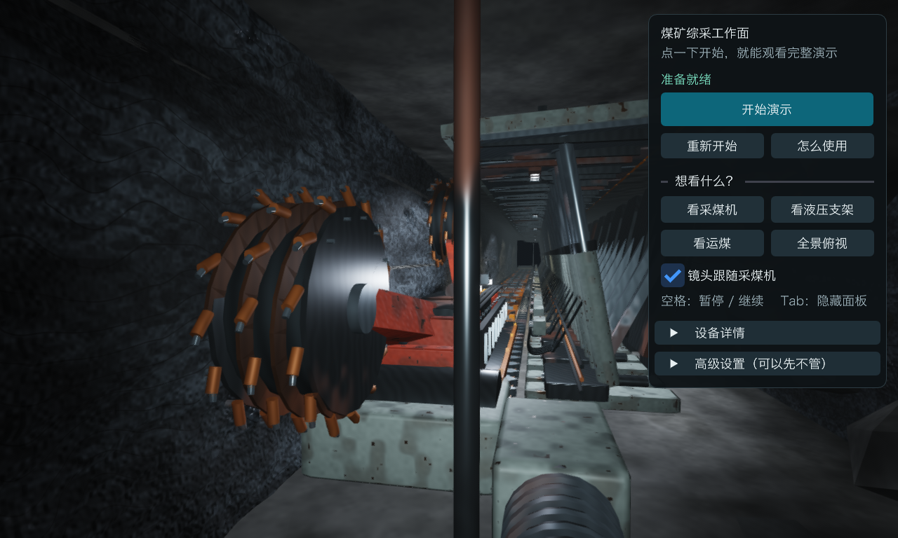

# 煤矿井下综采工作面仿真系统开发文档

计算机图形学课程项目

跨平台提交版　2026年9月23日

本系统使用 C++17 和 OpenGL 实现煤矿综采工作面的三维教学演示。提交内容包括开发文档、完整项目源码、Windows x64 程序和 Apple Silicon Mac 应用。本文说明系统结构、图形算法、设备联动、跨平台实现、构建方法和本次验证结果，供课程评阅与后续维护使用。

## 1 项目目标与功能

系统在同一三维场景中展示煤壁、双滚筒采煤机、刮板输送机、30 台液压支架、井下灯具及通风设施。所有设备网格和表面细节由代码生成，无需加载外部模型或图片纹理。场景运动以统一仿真时钟驱动，可观察割煤、运煤、端点换向及支架跟机动作。

用户点击“开始演示”后，系统依次初始化设备、启动输送机，再允许采煤机割煤。演示支持暂停、继续、重新开始、故障注入和锁存急停；相机可在六个固定视角与自由观察之间切换。该项目用于图形学课程展示，设备参数为演示参数，不构成真实矿山控制模型。



图 1　Mac 提交版的默认界面。截图来自本次实际 OpenGL 帧缓冲，画面为 1280×768 像素；中文面板与程序化设备均正常显示。

<!-- PAGE -->

## 2 系统架构与数据流

项目将设备状态与绘制分离。仿真模块只更新位置、速度、压力、温度和状态；渲染器读取这些结果，再生成画面。逻辑测试直接链接仿真静态库，因此不需要创建窗口，也不依赖 GPU。

| 模块 | 主要职责与入口 |
| --- | --- |
| Application | 窗口与 OpenGL 上下文、主循环、输入分发、帧率限制和退出；src/core/Application.cpp |
| Platform | 根据可执行文件位置定位资源，选择默认截图目录；src/core/Platform.cpp |
| SimulationController | 状态转换、联锁、故障、仿真时间、煤块运输和跟机触发 |
| Equipment | Shearer、HydraulicSupport、ScraperConveyor 分别维护三类设备的运动状态 |
| Renderer 与 Mesh | 程序化网格、模型矩阵、材质、灯光、阴影、拾取和截图 |
| PostProcessor | HDR 帧缓冲、MSAA、Bloom、SSAO、ACES 和 FXAA |
| Camera 与 Transform | 观察投影、固定机位、鼠标射线、父子层级变换 |
| UIManager | 中文控制面板、设备参数、故障操作、帮助和相机跟随 |

每帧先处理窗口事件与用户输入，再更新仿真和粒子，随后渲染场景、执行后处理、绘制界面并交换缓冲。界面请求通过控制器公开方法进入状态机，避免按钮直接修改设备内部状态。

```text
输入事件 → Application → SimulationController → 三类设备与煤块
                    ↓                       ↓
                  Camera              Renderer 读取状态
                                            ↓
                                   HDR 与后处理 → ImGui → 显示
```

Shader、Mesh 和渲染目标通过对象生命周期释放 OpenGL 资源。退出时先清理 ImGui 和 Renderer，再销毁 GLFW 窗口，保证释放 GPU 对象时图形上下文仍然有效。可复用网格只创建一次，设备实例通过不同模型矩阵定位。

<!-- PAGE -->

## 3 图形算法与场景实现

### 3.1 程序化建模与变换

基础网格包括立方体、倒角箱体、圆柱、不规则岩块、梯形支架盾板和滚筒螺旋叶片。采煤机由机身、摇臂、滚筒和截齿组合；液压支架由底座、立柱、顶梁、掩护梁和软管组合；输送机由槽体、链环、刮板和端部机构组成。

顶点保存位置、法线和 UV，通过 VAO、VBO、EBO 提交给 GPU。顶点位置按投影矩阵 P、观察矩阵 V、模型矩阵 M 的顺序变换。非均匀缩放使用模型矩阵的逆转置变换法线，以避免表面光照随缩放失真。

```glsl
gl_Position = projection * view * model * vec4(aPosition, 1.0);
normalMatrix = transpose(inverse(mat3(model)));
```

以上代码表示所用变换关系；实际着色器实现见 assets/shaders/mine.vert。父子 Transform 将摇臂与滚筒的局部运动合成为世界坐标，因而采煤机移动时各部件保持整体关系。

### 3.2 材质与渲染流程

片元着色器采用 GGX 微表面分布、Smith 几何项与 Schlick 菲涅耳近似，通过粗糙度、金属度和基础颜色区分煤岩、钢材、橡胶与掉漆涂层。表面噪声在着色器中生成，局部工作灯和相机头灯负责井下照明，距离雾增强空间深度感。

| 阶段 | 作用 |
| --- | --- |
| 工作灯阴影 | 可选双层 2048×2048 深度贴图与 PCF 采样，表达遮挡关系 |
| HDR 场景 | 场景写入 RGBA16F 多重采样目标，再 resolve 到单采样纹理 |
| Bloom 与 SSAO | 分别表达亮部扩散和接触处暗化；SSAO 可关闭 |
| ACES 与 FXAA | 将高动态范围映射到显示范围，并处理最终边缘锯齿 |
| ImGui 界面 | 在后处理完成后绘制，使文字不受曝光和 Bloom 影响 |

透明煤尘和水雾从实际滚筒位置生成，按观察深度排序后混合。暂停冻结粒子，停止后逐步消散，复位清空。鼠标拾取把屏幕坐标转换成世界射线，与设备 AABB 求交并选取最近命中对象。

<!-- PAGE -->

## 4 仿真控制与设备联动

状态机覆盖 Stopped、Initializing、Ready、StartingConveyor、CuttingForward、CuttingBackward、EndTransition、Paused、Warning、Fault 和 EmergencyStopped。控制器统一判断可达状态并记录转换事件。

正常流程为准备就绪 → 初始化 → 启动输送机 → 正向割煤 → 端部换向 → 反向割煤。输送机达到启动条件后，采煤机才进入运动状态。采煤机速度平滑趋近目标，在端点钳制位置并换向，避免越界或瞬时跳跃。

### 4.1 支架与运输

采煤机经过支架后触发独立的延迟计时。支架依次进入等待、降架、移架、升架和正常支撑阶段，通过连续插值更新高度与位移。各支架独立维护压力与阶段，不使用统一瞬移。

煤块从滚筒附近落入输送机槽体，再沿输送方向移动。煤块数量和粒子寿命设有上限，防止仿真持续运行时对象无限增长。相机、物体运动和粒子更新均使用时间步长，而非按每帧固定移动距离。

### 4.2 故障与急停

| 操作 | 系统行为 |
| --- | --- |
| 采煤机过热 | 温度进入故障范围，停止相关设备运动 |
| 输送机堵塞 | 输送速度归零，同时联锁停止采煤机 |
| 指定支架低压 | 相应支架显示低压，系统进入告警状态 |
| 照明故障 | 关闭工作灯，保留与照明有关的可见反馈 |
| 急停 | 立即停止运动并锁存；复位不能绕过锁存 |
| 解除急停与清除故障 | 回到可重新启动的状态，需要用户明确开始演示 |

暂停保存进入暂停前的状态，并冻结仿真时间；继续后恢复原运行状态。重新开始调用现有复位与启动流程，保留输送机联锁规则。图形帧率限制只影响显示更新频率，不改变上述业务约束。

<!-- PAGE -->

## 5 跨平台兼容与运行负载

### 5.1 macOS 兼容实现

原项目使用 Windows 字体环境变量和编译时写入的源码绝对路径。提交版通过平台 API 读取当前可执行文件位置：Mac 使用 _NSGetExecutablePath，Windows 使用 GetModuleFileNameW。Windows 的宽字符路径转为 filesystem 路径后，再以 UTF-8 传递给着色器文件加载器，支持中文提交目录。

macOS 请求 Core Profile 和 forward-compatible 上下文，并关闭 GLFW 自动切换资源目录的行为。GLAD 仍加载 OpenGL 3.3 核心功能；本次 M5 机器实际返回 OpenGL 4.1 Metal 上下文。绘制、着色和后处理由 GPU 执行，CPU 负责仿真与绘制指令提交。

| 项目 | macOS | Windows |
| --- | --- | --- |
| 程序格式 | Apple Silicon arm64 .app | x64 .exe |
| 着色器目录 | Contents/Resources/assets | exe 同级 assets |
| 中文字体 | 系统 Hiragino Sans GB | 系统微软雅黑 |
| 默认窗口像素 | 1280×768，普通像素分辨率 | 1500×900 |
| 默认场景 MSAA | 2× | 4× |
| 默认阴影与 SSAO | 关闭，可在高级设置开启 | 开启 |
| C++ 运行库 | macOS 系统库 | 静态链接编译器运行库 |

### 5.2 Mac 默认负载控制

原默认窗口在 Retina 屏幕上对应 3000×1800 像素，叠加高细节几何、两次阴影绘制及后处理，会同时增加 CPU 提交负担和 GPU 工作量。现改为 1280×768、最高 30 FPS；应用失去焦点时最高 5 FPS，最小化后停止绘制。阴影与 SSAO 默认关闭，保留灯光、材质、HDR、Bloom 和 FXAA。

新默认设置的单帧截图统计为 5008 次绘制，OpenGL 错误码为 0。该数字是绘制次数，不是性能跑分；本次不宣称固定实测帧率。高级设置中仍可开启阴影和 SSAO，开启后会增加运行负载。

F12 的默认截图在 Mac 保存到用户 Pictures/MineLongwallSimulation/latest.bmp，在 Windows 保存到 exe 同级 screenshots/latest.bmp。命令行 --capture-output 可指定独立输出位置。

<!-- PAGE -->

## 6 构建运行与提交结构

### 6.1 直接运行

Windows：完整解压提交文件夹，打开 03_Windows程序，双击 MineLongwallSimulation.exe 或启动脚本。保留同目录的 assets 文件夹。运行需要支持 OpenGL 3.3 的显卡驱动。

Mac：打开 04_macOS程序，双击 MineLongwallSimulation.app。当前二进制适用于 Apple Silicon；Intel Mac 需在相应机器上重新编译。Mac 应运行 .app，Windows 应运行 .exe。

点击“开始演示”即可进入自动演示；空格用于开始、暂停或继续，1 至 6 切换固定机位，右键拖动观察，WASD 和 QE 控制移动，Tab 隐藏面板，Esc 退出。故障演示位于高级设置中。

### 6.2 从源码构建

开发依赖为 CMake 3.24+、Python 3、C++17 编译器。macOS 使用 Xcode Command Line Tools，Windows 可使用 Visual Studio 2022 的 C++ 桌面开发工具。首次构建需联网获取固定版本依赖。

```sh
# macOS 在 02_源代码 中执行
./build.sh
./run.command
```

```bat
rem Windows 在 02_源代码 中执行
build.bat
run.bat
```

脚本在 .venv-build 中安装 Jinja2，并直接使用固定 GLAD 2.0.8 源码生成加载器，不修改系统 Python。GLM 1.0.1、GLFW 3.4 和 ImGui 1.91.8 由 CMake FetchContent 获取。构建脚本使用 2 个并行任务，并运行现有逻辑测试。Mac 产物位于 build-macos/bin/Release，Windows 产物位于 build/bin/Release。

本次 Windows 交叉构建采用 cmake/mingw-w64.cmake，具体命令见 README 的“在 macOS 生成 Windows 提交程序”。CMake 的 Runtime 安装组件可导出带完整资源的程序，资源路径不依赖开发者的源码目录。

```text
提交文件夹_煤矿综采工作面仿真/
  00_提交说明.txt
  01_开发文档/       开发文档 DOCX 与 PDF
  02_源代码/         src assets tests cmake 及构建脚本
  03_Windows程序/    MineLongwallSimulation.exe 与 assets
  04_macOS程序/      MineLongwallSimulation.app
```

<!-- PAGE -->

## 7 验证记录与边界

本次验证日期为 2026 年 9 月 23 日。原始仓库基线为 9e7fd29，修改基于同名本地工作区完成。原有 Windows 历史测试记录保留在 docs/TEST_REPORT.md，不作为本次重新运行的证据。

| 检查项目 | 本次证据 |
| --- | --- |
| Mac Release 构建 | AppleClang 21 与 CMake 4.4.3 构建成功 |
| 逻辑测试 | CTest 1/1 通过，测试程序内部 36/36 检查通过 |
| GPU 与上下文 | macOS 27，Apple M5，OpenGL 4.1 Metal - 91.7 |
| 动态图形运行 | 自动模式推进到仿真 4 秒，状态 Cutting forward，截图成功，GL error=0 |
| 中文与交互 | 实际窗口显示中文，空格启动、换向运行与暂停状态已观察 |
| 默认低负载画面 | 1280×768 截图成功，5008 次绘制，GL error=0 |
| 资源随包移动 | 提交目录中的 .app 从 /tmp 工作目录启动并完成截图 |
| Windows 交叉构建 | MinGW GCC 16.2 Release 构建成功，生成 Windows x64 PE 程序；导入项为 Windows 系统 DLL |

动态割煤与顶视截图最初在高画质设置下完成；降低 Mac 默认负载后又完成短时截图验证。新版不在后台持续进行图形验证，避免影响其他应用使用。

Windows 交叉编译检查可以证明源码生成了 Windows 程序，并检查其运行库依赖；当前机器是 Mac，本次未完成 Windows 实机窗口和显卡驱动验证。Apple Silicon Mac 已实际运行，Intel Mac、其他 GPU 和最低目标 macOS 11 尚未逐机验证。

系统使用程序化教学模型，未实现煤岩体积切削、真实岩层力学、GPU 实例化、外部 CAD 导入或配置持久化。AABB 拾取是设备包围盒近似。项目保持原有状态机和设备规则，本次主要变更为平台启动、字体、资源打包与 Mac 负载控制。

代码阅读入口：建议按 main.cpp → Application.cpp → SimulationController.cpp → Renderer.cpp → PostProcessor.cpp 阅读。设备结构与动作分别位于 src/equipment；着色器位于 assets/shaders；tests/LogicTests.cpp 可用于核对状态机、暂停、急停、支架动作和粒子规则。

项目仓库：https://github.com/mohui666/2026-Computer-Graphics-Course-Project

图形参考出处见 docs/REALISM_REFERENCES.md。运行时请保留各程序目录中的完整资源。
